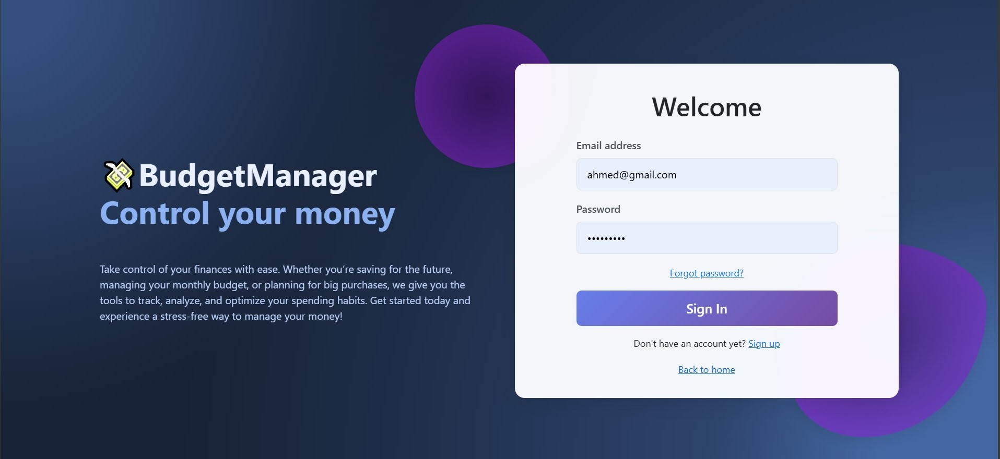
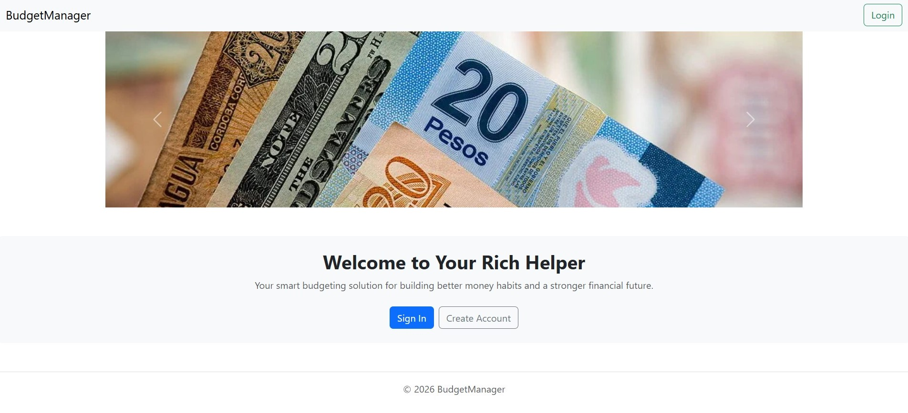
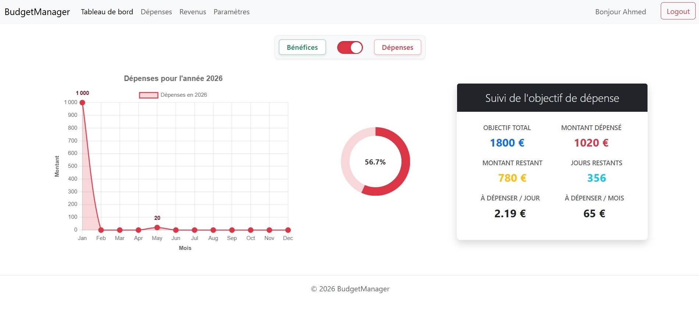
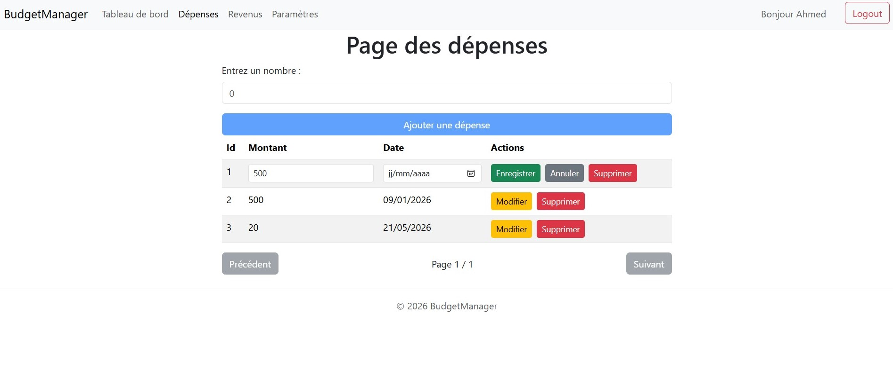
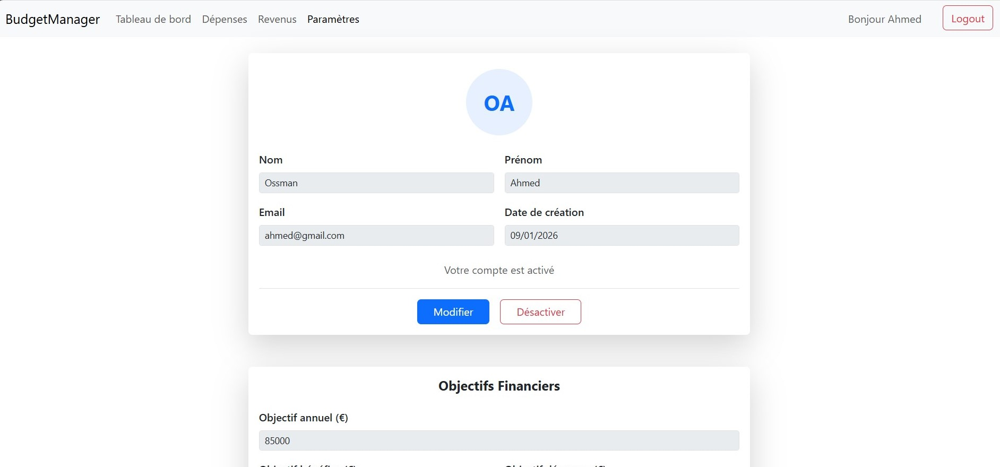

# Budget Tracker - Angular

---

## Description
Budget Tracker est une application web de suivi de budget personnel. Elle permet aux utilisateurs de suivre leurs revenus et dépenses, de visualiser des statistiques via des graphiques et de gérer leur budget de manière intuitive.

---

## Fonctionnalités
- Authentification sécurisée (inscription et connexion)  
- Gestion des transactions : ajout, modification, suppression  
- Catégorisation des revenus et dépenses  
- Dashboard avec statistiques et graphiques interactifs  

---

## Technologies utilisées
- Angular  
- Chart.js  

---

## Architecture Angular
- `core/` : services globaux, guards et interceptors  
- `features/` : modules principaux (auth, dashboard, transactions)  
- `shared/` : composants réutilisables, pipes, directives  

---

## Captures d'écran

### Page Login

### Page d'accueil

### Dashboard 

### Ajout de transaction

### Paramétres

